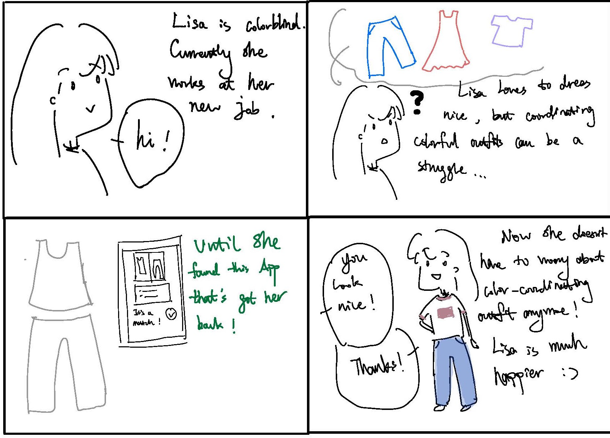
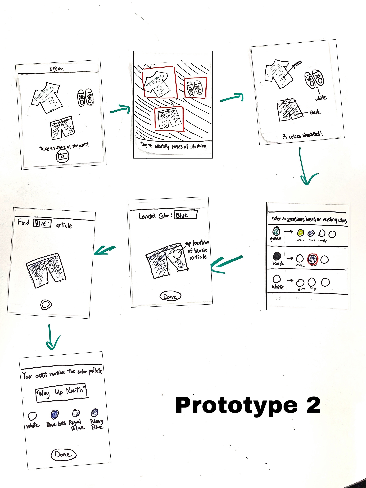

# TeamName
### Team:
- Andrew Li
- David Dinata
- Melody Xue
- Zhizhu Wang

### Pitch 
After discussion, we decided to design an application to assist people with color blindness. Help them style their outfits by helping them correctly identify colors and recommending aesthetically pleasing color combination from our database that match well with the color of the clothing. Our target user population is people with (various degrees of) color blindness.  None of our team members are color blind, but we recognize there are people around us who are color blind and struggle to pick out outfits on a daily basis.  Some of them would have to ask their friends and parents to assist them in matching their outfit before going out. 

We were inspired by this story and came up with the idea of creating an outfit assistance specifically targeted at color blind users.  This app would help save our target users the trouble of color-coordinating outfits.  Since none of our team members are color blind, our app idea fits the project theme of designing for people very different from ourselves. 

We plan to scrape data from this website 
- https://www.canva.com/colors/color-palettes/  
We will use this to create a database containing around 4000 preset color combinations.  
In addition, we plan to use a camera API 
- https://developer.mozilla.org/en-US/docs/Archive/B2G_OS/API/Camera_API/Introduction  
For scanning articles of clothing to help people with colorblindness to correctly identify colors.
 
Another API that might be useful is the color generator API by Canva.
- https://www.canva.com/colors/color-palette-generator  
This API will return colors found in an image. The problem we see is that  it will also detect colors of the background. We might have to do this manually by having users identify individual articles of clothing but this is one possible method. 
 

Storyboard 1: 

Storyboard 2: 

Paper prototype 1: 

Paper prototype 2: 
