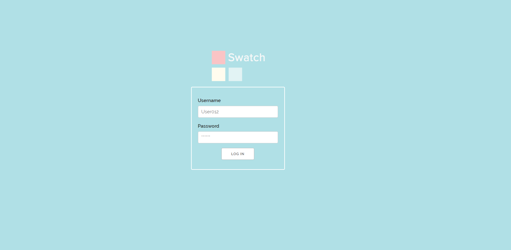
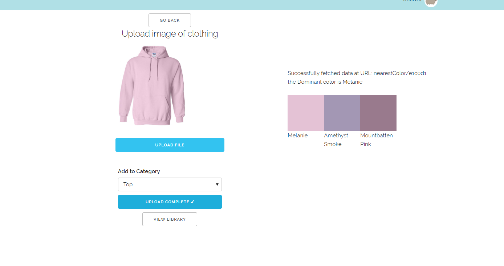
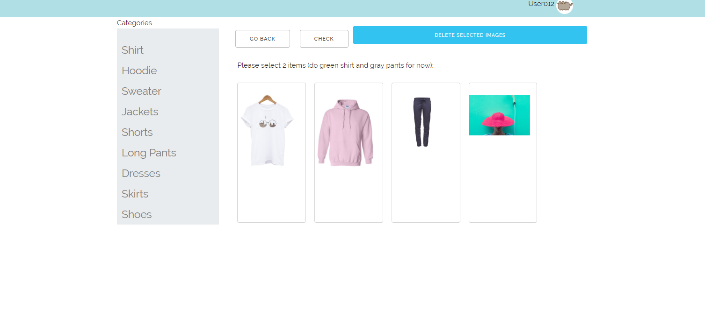
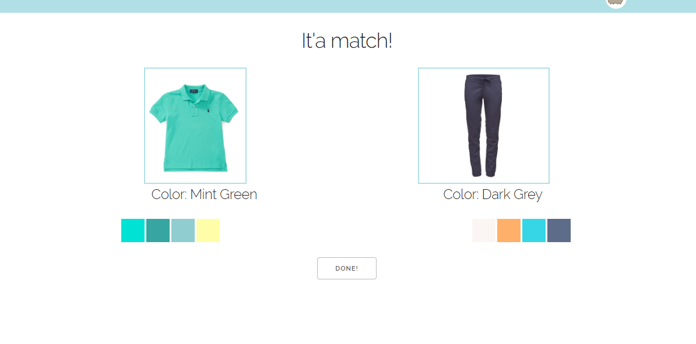

# Milestone 3
## Firebase
So we decided to use Firebase as a database to help store clothes from the user. In the future we will integrate google users with our app. 

## UI Skeleton Screenshots

Home Page: 
### we added a login page instead of directly going to uploading or library
Scan Page: 
### allow user to add image to Firebase, added category to that upload. Also fixed some of the formatting issue of uploading some large images.
Library Page: 
### Added a side menu bar, allows images to automatically update from the firebase and delete clothes from it
Match page: 
### The same page. Functionality to be implemented when we are able to set up the recommendations/pairing later. Will also plan to add past outfits into this as well.

