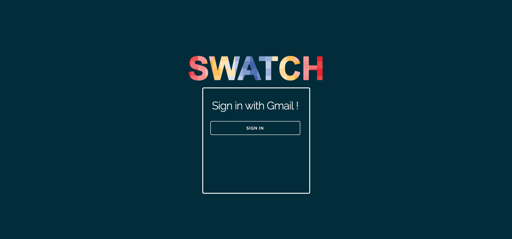
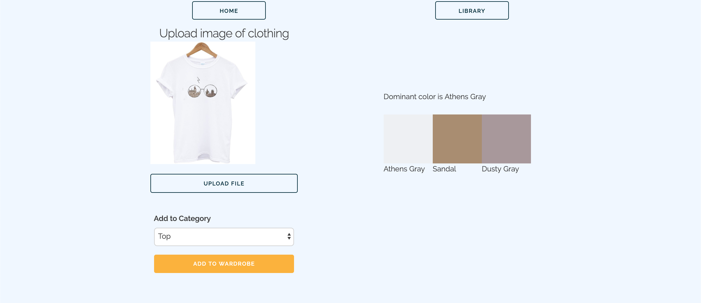
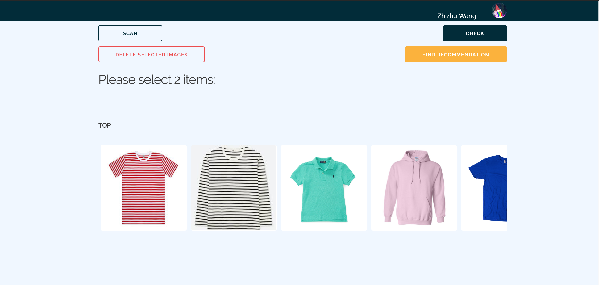
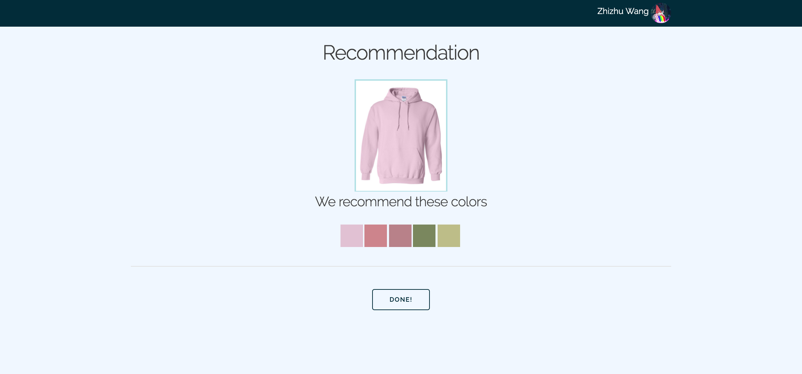

# Milestone 4
We have further improved User Interface since milestone3.  For example we selected a darker theme, designed a new Logo, and have improved how the buttons should be layed out.  We also further built the core functionalities of the app,

## New UI Screenshots

### 1. We added a login page and have implemented Gmail authentication through Google Firebase.
Home Page: 

### 2. We now We fixed the layout of the page and modified the color scheme.
Scan Page: 

### We now uses a horizontal scroll to look through the pictures users upload to their wardrobe.
Wardrobe Page: 

### Users can select one item from their wardrobe to see other color combo/recommendations.  We will add the names of each color to accomendate people with various degrees of color-blindness.
Recommend page: 

## USER ACTION 1 : UPLOAD
This functionality allows users to upload articles of clothing into their wardrobe. To perform, navigate to the upload page. Press the 'Upload file' and choose an image. Then choose a category from the dropdown and then click the 'Add to Wardrobe' buttton.

## USER ACTION 2 : FIND RECOMMENDATIONS
This functionality allows users to upload articles of clothing into their wardrobe. To perform, navigate to the upload page. Press the 'Upload file' and choose an image. Then choose a category from the dropdown and then click the 'Add to Wardrobe' buttton.
