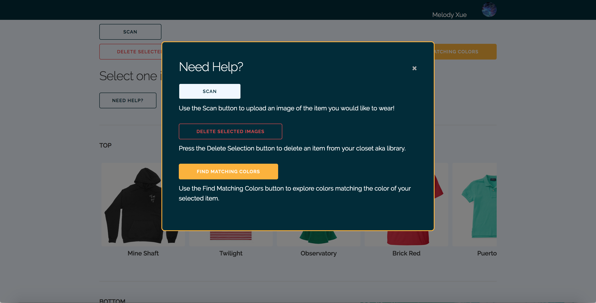
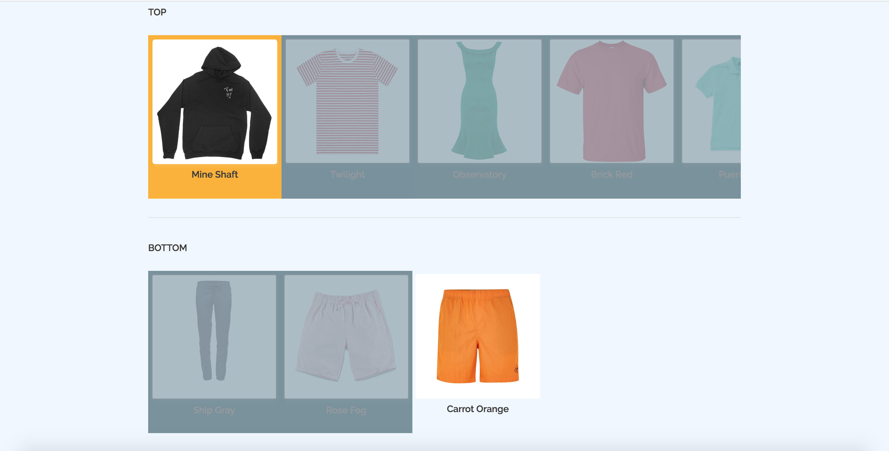

# Milestone 5
## Target Population Usage of App (paragraph)(setting+sequence+satisfaction)
Our target population is colorblind people. 
#### Setting: 
Our target population often encounter difficulties matching the color of outfits, and might need their parents' or friends' help, which could be inefficient and time consuming when in a rush. We often hear our color blind friends helplessly complaining about this tricky situation.
#### Sequence: 
With swatch, colorblind people can easily upload a piece of clothing they would like to wear and our app will instantly check the user's existing closet database for clothes in other categories (such as "Bottom", "Outerwear")that have matching colors, and display those matching pieces by greying out other unmatched items. 
#### Satisfaction: 
Colorblind people can pick out matching outfits within minutes, saving them both time and effort in the morning. 

## New UI Screenshots
Library Help: 
Recommend Color: 
## How UI has improved (paragraph)
We updated our UI by adjusting the position of buttons and impelmenting both the library page and recommendation page.
#### Library: 
We added a new help button with a pop up box with instruction regarding each button on the library page. This pop up help page is desgined to help users better navigate through our app.
#### Recommendation/Find matching colors:
We changed our find recommendation page to find matching colors. Users have the option to select multiple items and check for other matching colors to the selected items, if they wish to.
## Visualized Data Screenshots
Library Match: 
## Implementation of Data Display (paragraph)
We implemented our data display to show users matches to their selected items instantly on the library page, instead of displaying just matching colors on a different page as we did in milestone 4.
#### Library:
We displayed our data so that, once users select an item, the box for that items will turn yellow, and other items whose colors don't match that of the selected item will grey out, and those with matches will display normally on the page. User can build up to an entire outfit by selecting the suggested item(s) along with the initial item!

## More Ambitious Data Display (paragraph)
1. Display the hierarchy of matched items. For example, marking the best match, second best match and third best match on the page. This way, we can better help colorblind people tailor outfits to their needs, since there could be multiple pieces of clothing that could match the selected item if the database grows, and they could be stuck on which item to choose with the hierarchy marking.
2. Add preset style themes. For example, categorizing all spring color items under the theme "Spring". This way users can picked clothing based on their mood, and the impression they wish to leave. If a user is feeling grungey, he/she could go to the "grungey" theme, and pick clothes categorized in that theme.

